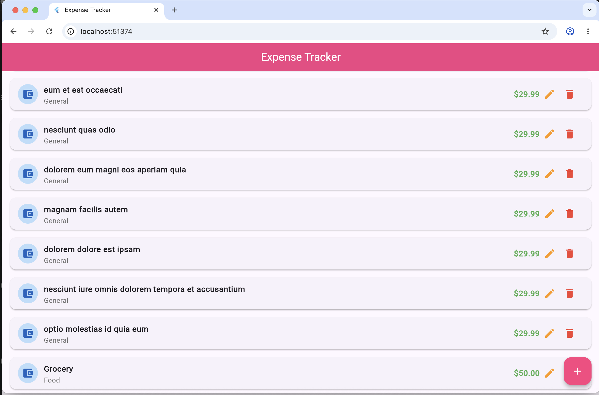
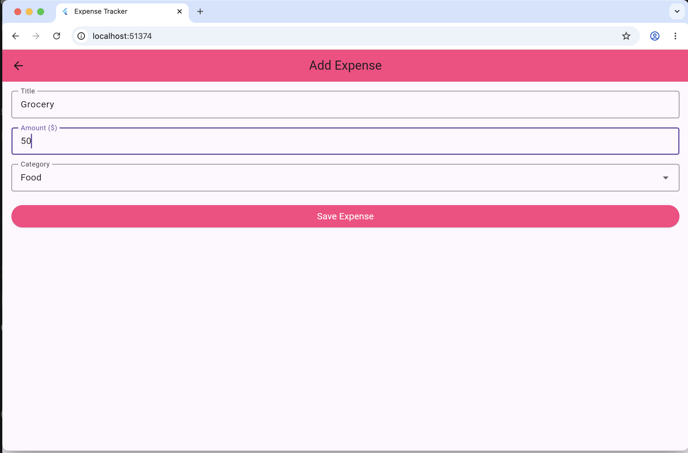
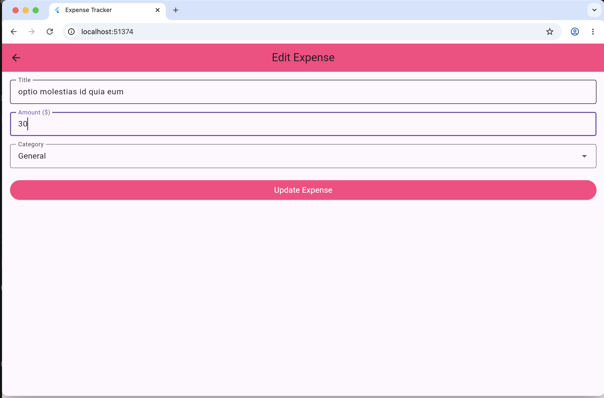
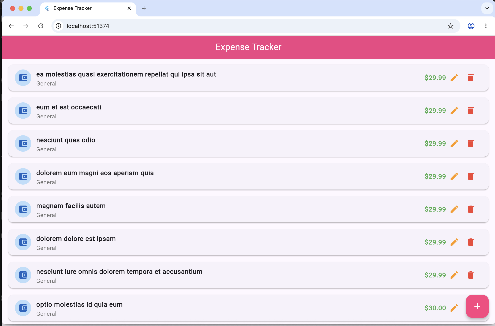

# expense_manager

A Flutter application for managing expenses using Bloc state management, Dio HTTP client, and a clean layered architecture.  
The app performs full CRUD (Create, Read, Update, Delete) operations using a public REST API.

# Features

- View list of expenses (Read)
- Add new expense (Create)
- Update existing expense (Update)
- Delete expense (Delete)
- Loading states handling
- Error handling
- State management using Bloc

#  Project Structure

lib/
│
├── bloc/
│   ├── expense_bloc.dart
│   ├── expense_event.dart
│   └── expense_state.dart
│
├── models/
│   └── expense_model.dart
│
├── screens/
│   ├── home_screen.dart
│   └── manage_expense_screen.dart
│
├── services/
│   └── api_service.dart
│
├── widgets/
│   └── expense_card.dart
│
└── main.dart

#  Screenshots

##  Home Screen

---

##  Add Expense Screen

---

##  Update Expense Screen

---

##  Delete Expense Action
